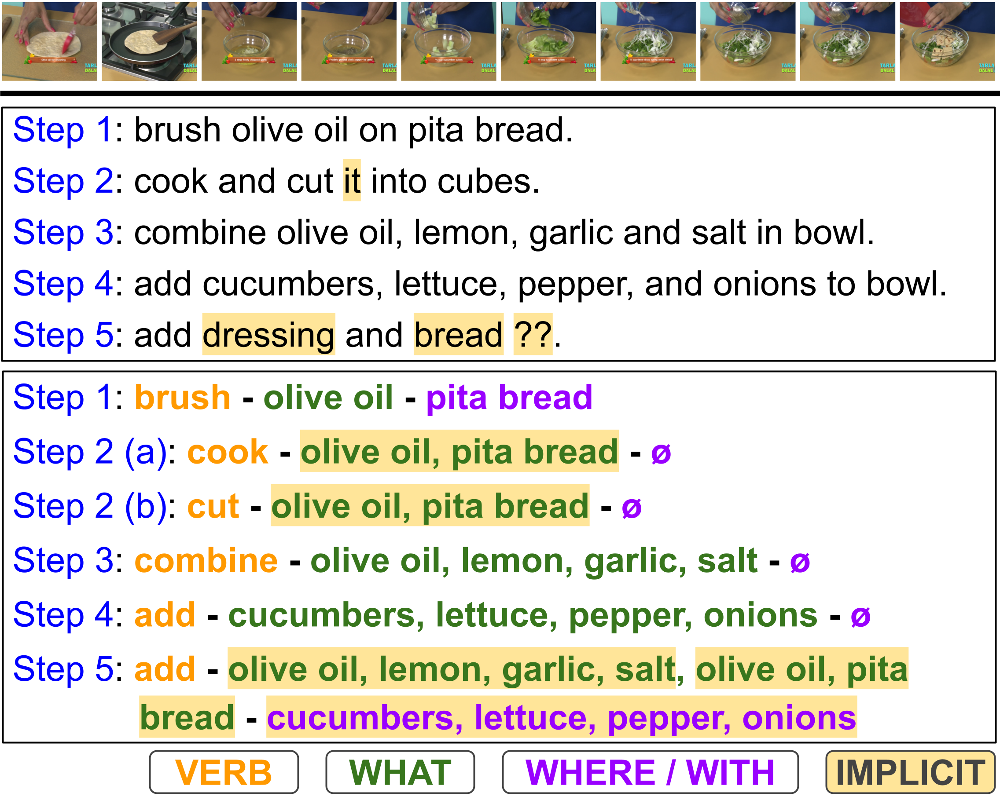

<div align="center">

<h2>Predicting Implicit Arguments in Procedural Video Instructions</h2>

**[ACL 2025 (Main)](https://2025.aclweb.org/)** in Vienna, Austria (July 27 – August 1st, 2025).

[Anil Batra](https://anilbatra2185.github.io/), [Laura Sevilla-Lara](https://laurasevilla.me/), [Marcus Rohrbach](https://rohrbach.vision/), [Frank Keller](https://homepages.inf.ed.ac.uk/keller/) 
</div>

<p align="center">
  
</p>

## :page_facing_up: Citation

If you find this project useful in your research, please consider cite:
```BibTeX

@inproceedings{
    batra2025implicit,
    title={Predicting Implicit Arguments in Procedural Video Instructions},
    author={Anil Batra and Laura Sevilla-Lara, Marcus Rohrbach, Frank Keller},,
    booktitle={The 63rd Annual Meeting of the Association for Computational Linguistics},
    year={2025}
}
```

### Licenses
This code is released under the MIT License.
The licenses for datasets used in the paper are available at the following links: [YouCook2](https://github.com/LuoweiZhou/ProcNets-YouCook2/blob/master/LICENSE), and [Tasty](https://cvml.comp.nus.edu.sg/tasty/download.html).